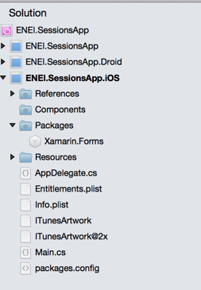
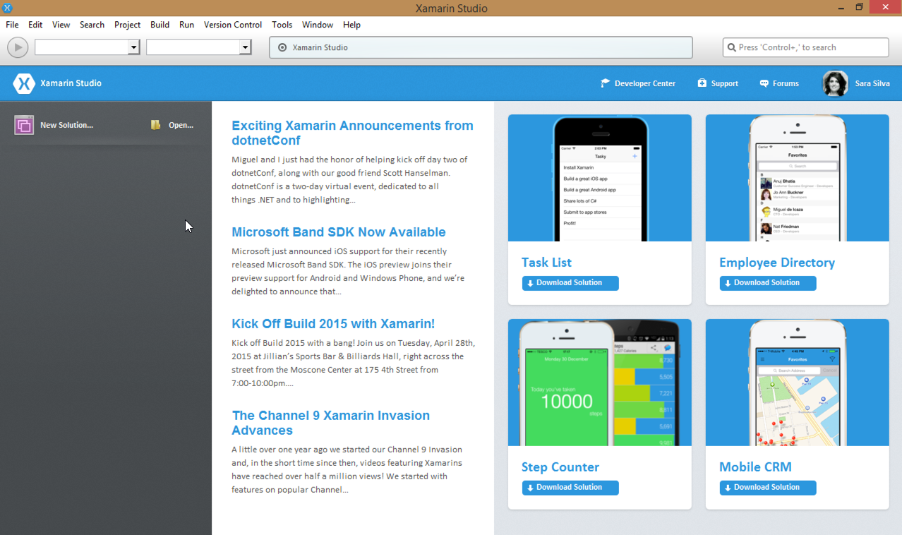
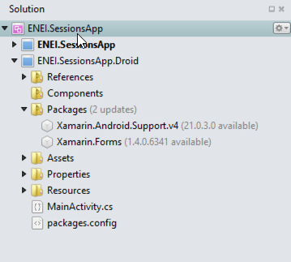
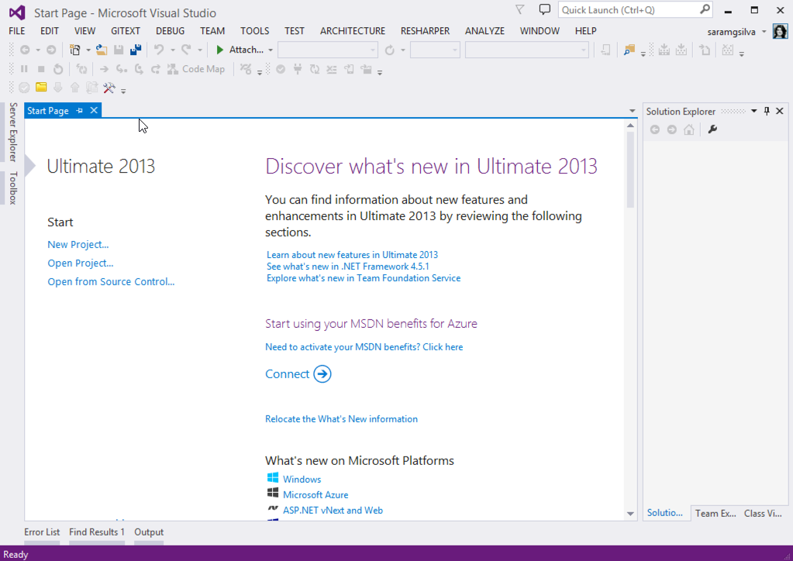
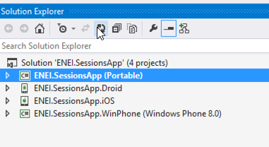
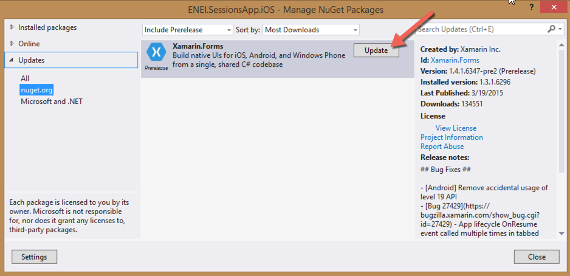
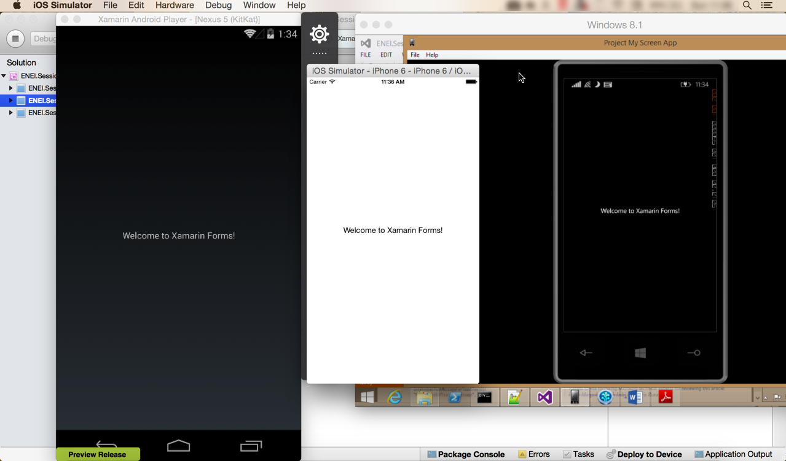

# 1010 ENEI || Xamarin Workshop



 
## Guide 1.	Create a Xamarin Forms project 

The application you will create is a Xamarin Forms application, based in Portable Class Library project. 


#### Using Xamarin Studio in Mac

Start by opening the Xamarin Studio as described in figure 1



**Figure 1: Xamarin Studio in a Mac**

Then create a new Blank App (Xamarin Forms Portable), as following:




**Figure 2: Creating a Blank App (Xamarin Forms Portable)**


Which result will be something as described in Figure 3:




**Figure 3:  The ENEI.SessionsApp solution**


The ENEI.SessionApp solution is defined by three projects:


* **ENEI.SessionsApp:** portable class library project, which will contain the shared code between targets. This project is independent of the platform;
* **ENEI.SessionsApp.Droid:** Xamarin Android project, which define the Android application and knows the Android API;
* **ENEI.SessionsApp.iOS:** Xamarin iOS project, which define the iOS application and knows the iOS API;

Now, you should update the [NuGet Packages](https://www.nuget.org/) available in project. In the case described in figure 4, you only need to update the [Xamarin Forms NuGet Package](https://www.nuget.org/packages/Xamarin.Forms):



**Figure 4: Xamarin Forms Nuget package to update in iOS application**


To update this package you only need to open the context menu, doing a right click with the mouse and then click “Update”, as described in Figure 5:



**Figure 5: Updating NuGet packages**


The result will be



**Figure 6: iOS project updated**

You need to do the same in the others projects, if needed.
Before run the application, you should select the solution and define the configurations, as following:



**Figure 7: Configuration Properties**

Wowwww, now you are ready to create your 1010 ENEI Session app! 

#### Using Xamarin Studio in Windows

Start by opening the Xamarin Studio as described in figure 8:



**Figure 8: Xamarin Studio in Windows**


Then create a new Blank App (Xamarin Forms Portable), as described in the following figure:



**Figure 9: Creating a Blank App (Xamarin Forms Portable)**


The result will be something as described in figure 10:



**Figure 10:  The ENEI.SessionsApp solution**


The ENEI.SessionApp solution is defined by two projects:

* **ENEI.SessionsApp:** portable class library project, which will contain the shared code between targets. This project is independent of the platform;
* **ENEI.SessionsApp.Droid:** Xamarin Android project, which define the Android application and knows the Android API;

Now, you should update the [NuGet Packages](https://www.nuget.org/) available in the project. In the case described in figure 11, you only need to update the [Xamarin Forms NuGet Package](https://www.nuget.org/packages/Xamarin.Forms) and the [Xamarin.Android.Support.v4 NuGet Package](https://www.nuget.org/packages/Xamarin.Android.Support.v4/):



**Figure 11: Nuget packages to update in Android application**

To update this package you only need to open the context menu, doing a right click with the mouse and then click “Update”, as described in figure 12:



**Figure 12: Updating Nuget packages**

The result will be



**Figure 13: Android project updated**


You need to do the same in the other project, if needed.
Wowwww, now you are ready to create your 1010 ENEI Session app! 

##### Using Visual Studio in Windows

Start by opening the Visual Studio as described in figure 14
 



**Figure 14: Visual Studio 2013**

And then create a new Blank App (Xamarin Forms Portable), as following:



**Figure 15: Creating a Blank App (Xamarin Forms Portable)**


Which result will be something as described in figure 16:


**Figure 16:  The ENEI.SessionsApp solution**


The ENEI.SessionApp solution is defined by four projects:

* **ENEI.SessionsApp:** portable class library project, which will contain the shared code between targets. This project is independent of the platform;
* **ENEI.SessionsApp.Droid:** Xamarin Android project, which define the Android application and knows the Android API;
* **ENEI.SessionsApp.iOS:** Xamarin iOS project, which define the iOS application and knows the iOS API;
* **ENEI.SessionsApp.WinPhone:** Windows Phone project, which define the Windows Phone application and knows the Windows Phone API;

Now, you should update the [Nuget Packages](https://www.nuget.org/) available in the project. This case you only need to update the [Xamarin Forms Nuget Package](https://www.nuget.org/packages/Xamarin.Forms), as described in figure 17 and figure 18:



**Figure 17: Opening the “Manage NuGet Package” window**



**Figure 18: Nuget Package Manager**

The result will be



**Figure 19: Xamarin Forms NuGet package updated**

You need to do the same in the others project, if needed.

Before run the application, you should select the solution and define the build and deploy apps, as following:



**Figure 20: Configuration Properties**

Wowwww you ready to create your 1010 ENEI app! 

#### Running the application

Depending the scenario you are, you will have more or less platforms covered, here is an overview:

* **Using Xamarin Studio in a Mac:** Android + iOS Apps
* **Using Xamarin Studio in Windows:** Android Apps
* **Using Visual Studio without Xamarin plugin:**  Windows Apps
* **Using Visual Studio with Xamarin plugin:** Windows, Android and iOS (*) apps.


(*) Is required a Xamarin Build Host in a Mac connect to Visual Studio.


In figure 21, is possible to see the Android, iOS and Windows Phone applications running at the same time. The Android app is running in Xamarin Android Player, iOS app is running in IPhone Simulator and Windows Phone application is running in a Lumia 1020 device (which is connect to a Windows running in a Parallels, in a Mac).



**Figure 21: Android, iOS and Windows Phone applications running at same time**



#### Additional notes - Xamarin Forms initialization 

Each developer should understand how Xamarin Forms app is defined. This way, developers should know:
In ENEI.SessionsApp.iOS app, more specific in AppDelegate.cs has the following code:

     public override bool FinishedLaunching(UIApplication app, NSDictionary options)
     {
            global::Xamarin.Forms.Forms.Init();
            LoadApplication(new App());

            return base.FinishedLaunching(app, options);
    }


Which initialize the Xamarin Forms and define which class has the start point for the Xamarin Forms App that defines the main page created with the Xamarin Forms API.
The same happens in ENEI.Sessions.Android app, more specific in MainActivity.cs:

    protected override void OnCreate(Bundle bundle)
    {
            base.OnCreate(bundle);

            global::Xamarin.Forms.Forms.Init(this, bundle);
            LoadApplication(new App());
    }


And in ENEI.Sessions.WinPhone app, more specific in MainPage.xaml.cs

      public MainPage()
      {
            InitializeComponent();
            SupportedOrientations = SupportedPageOrientation.PortraitOrLandscape;

            global::Xamarin.Forms.Forms.Init();
            LoadApplication(new ENEI.SessionsApp.App());
     }


At this moment, the App.cs defined in ENEI.SessionsApp (portable class library) is defined by

    public class App : Application
    {
        public App()
        {
            // The root page of your application
            MainPage = new ContentPage
            {
                Content = new StackLayout
                {
                    VerticalOptions = LayoutOptions.Center,
                    Children = {
						new Label {
							XAlign = TextAlignment.Center,
							Text = "Welcome to Xamarin Forms!"
						}
					}
                }
            };
        }
     …




As mentioned early, the ENEI.SessionsApp will be the project, which will have the shared code between targets and it is independent of the platform. This way, in this project you will define the Model, the Views, the data source and other useful class that can be reused between platforms.


> Next step [**Guide 2: Create the model and the data source**](2. Create the model and the data source.md)